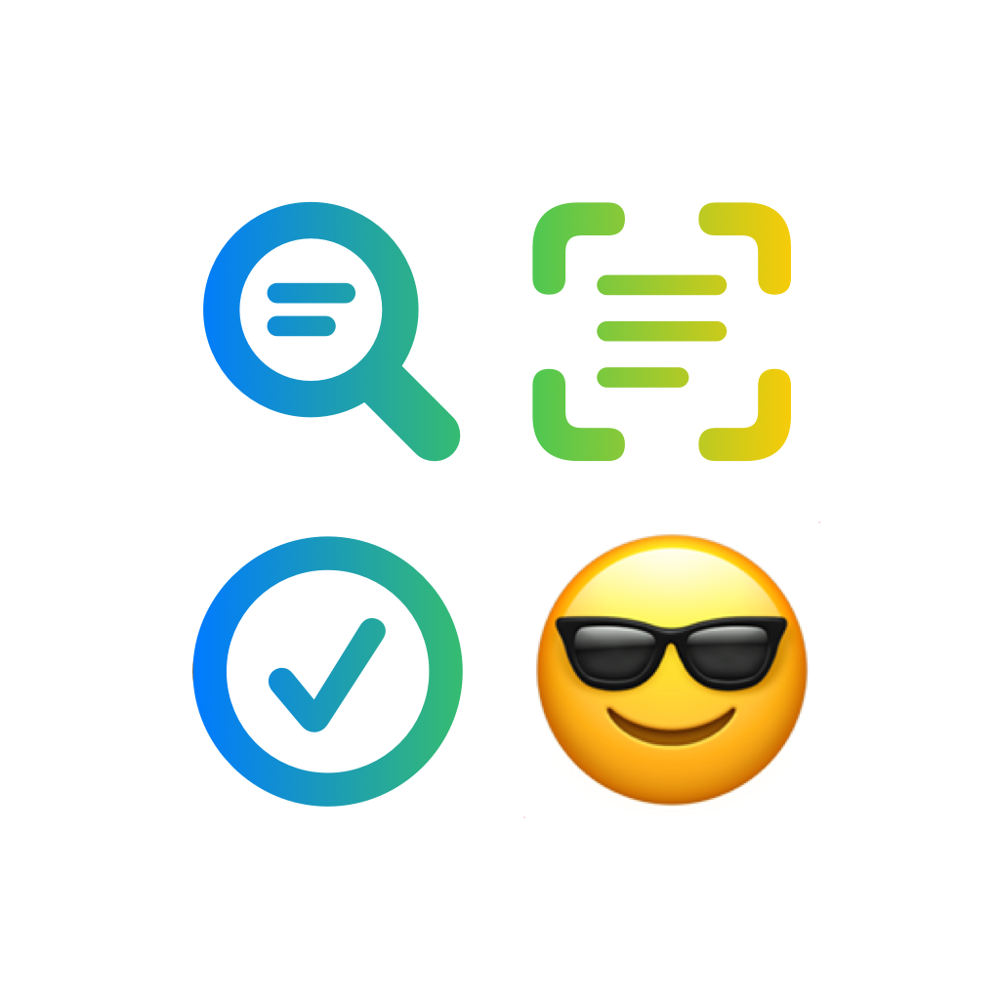

<p align="center">
   
</p>
<p align="center">
   <strong>text-to-🤩</strong><BR>
   🤷‍♂️ Not sure why you'd need this.
</p>
<p align="center">
   
   
   
   <a href="https://www.twitter.com/wouterwisse" target="_blank">
      
   </a>
</p>

## Installation
`Xcode` → `File` → `Add packages...` → enter url → `https://github.com/WouterWisse/text-to-emoji`

## How to use
#### Get an emoji
```swift
let emoji = await TextToEmoji.emoji(for: "tomato") // 🍅
```
This is an `async` method that will `throw` the error `noMatchFound` if no emoji has been matched with the given text.

#### Get an emoji for a preferred category
```swift
let shrimp = TextToEmoji.emoji(for: "shrimp", preferredCategory: .foodAndDrink) // 🍤
```
```swift
let shrimp = TextToEmoji.emoji(for: "shrimp", preferredCategory: .animalsAndNature) // 🦐
```
With `preferredCategory`, you can give a certain emoji category a higher priority. This can be very useful if you already know the context in which you are searching. For example, when looking for the word `shrimp`, two matching emoji's could be: `🦐` and `🍤`.<br/>
By passing `.foodAndDrink` as the `preferredCategory`, the first match will be `🍤`. Passing `.animalsAndNature` would result in `🦐`.

See `EmojiCategory.swift` for all categories.

## Localization
| Languages    | Supported   |
|--------------|-------------|
| 🇬🇧 English   | ✅          |
| 🇳🇱 Dutch     | ✅          |
| 🇩🇪 Deutsch   | ⏳          |
| 🇪🇸 Español   | ⏳          |
| 🇫🇷 Français  | ⏳          |
| 🇮🇹 Italiano  | ⏳          |
| 🇵🇹 Português | ⏳          |

## Contribution
Feel free to help me out here, especially with the localization.

## Keep me caffeinated
<a href="https://www.buymeacoffee.com/wouterwisse" target="_blank">
   
</a>
